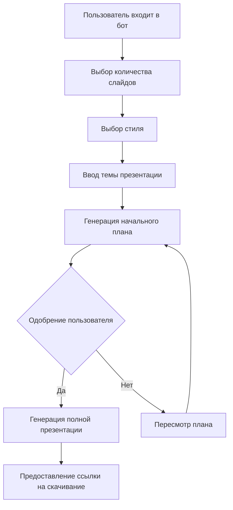

# Бот-генератор презентаций на базе ИИ
## Обзор проекта и предложение по MVP

### Краткое описание
Мы разрабатываем бот-генератор презентаций на базе ИИ, который создает профессиональные презентации на основе пользовательских запросов. Система автоматизирует создание учебных презентаций через простой чат-интерфейс, используя передовые технологии ИИ и облачные сервисы для создания презентаций.

### Рыночные возможности
- **Целевая аудитория**: Основной фокус на студентах и образовательном секторе
- **Текущие проблемы**: 
  - Трудоемкий процесс создания презентаций
  - Потребность в профессионально выглядящих презентациях
  - Ограниченные навыки дизайна у пользователей
- **Конкурентное преимущество**: Автоматизированное решение на базе ИИ с существующей базой клиентов-студентов

### Техническая архитектура

#### Основные компоненты
1. **Пользовательский интерфейс**
   - Интерфейс Telegram-бота для MVP
   - Простой, пошаговый процесс взаимодействия
   - Структурированный сбор информации

2. **Слой обработки ИИ**
   - Интеграция с GPT-4 для генерации текста
   - Динамические настройки temperature на основе предпочтений стиля:
     - Формальный: 0.0
     - Умеренный: 0.5
     - Креативный: 1.0

3. **Генерация презентаций**
   - Интеграция с PowerPoint Generator API
   - Генерация слайдов на основе шаблонов
   - Стандартизированные выходные форматы (.pptx, PDF)

### Функции MVP и рабочий процесс

#### Реализация Фазы 1
1. **Ограниченный объем**
   - Максимум 10 слайдов на презентацию
   - Предопределенные шаблоны
   - Фиксированные изображения (без динамической генерации на начальном этапе)

2. **Пользовательский процесс**




#### Варианты стилей
| Стиль     | Temperature GPT-4 | Применение |
|-----------|------------------|-----------|
| Формальный| 0.0             | Академические презентации |
| Умеренный | 0.5             | Общего назначения |
| Креативный| 1.0             | Увлекательные презентации |

### Детали технической интеграции

#### Процесс генерации презентации
1. **Получение контента от GPT-4**
   - Генерация текста для каждого слайда
   - Структурирование контента по разделам
   - Определение мест для изображений

2. **Формирование API-запроса**
   - Базовая структура запроса для PowerPoint Generator API
   - Интеграция сгенерированного контента
   - Управление шаблонами и стилями

#### Пример интеграции API с контентом
``` json
{
  "presentation": {
    "template": "education_template",
    "export_version": "Pptx2013",
    "resultFileName": "presentation_output",
    "slides": [
      {
        "type": "slide",
        "slide_index": 0,
        "shapes": [
          {
            "name": "Title_1",
            "text": "Введение в квантовую физику",
            "text_content": [
              {
                "text_run": "Введение в квантовую физику",
                "text_properties": {
                  "bold": true,
                  "size": 44
                }
              }
            ]
          },
          {
            "name": "Content_1",
            "text": "Сгенерированный GPT-4 текст для первого слайда...",
            "text_properties": {
              "size": 24
            }
          },
          {
            "name": "Image_1",
            "filename": "quantum_illustration.jpg",
            "settings": {
              "height": 300,
              "width": 400,
              "top": 200,
              "left": 100,
              "unit": "pt"
            }
          }
        ]
      },
      {
        "type": "slide",
        "slide_index": 1,
        "shapes": [
          {
            "name": "Title_2",
            "text": "Основные принципы",
            "text_properties": {
              "bold": true
            }
          },
          {
            "name": "ContentBox_1",
            "text": "Сгенерированный GPT-4 текст для второго слайда..."
          }
        ]
      }
    ]
  }
}
```

### План разработки

#### Фаза 1 (MVP)
- [x] Базовый интерфейс Telegram-бота
- [x] Интеграция GPT-4 для генерации текста
- [x] Интеграция PowerPoint API
- [x] Базовая система шаблонов
- [x] Функционал скачивания

#### Будущие улучшения
- [ ] Динамическая генерация изображений (Stable Diffusion/DALL-E)
- [ ] Расширенные опции кастомизации
- [ ] Веб-интерфейс
- [ ] Интеграция с Google Slides
- [ ] Загрузка пользовательских шаблонов

### Тестирование и валидация
1. **Начальное тестирование**
   - Внутренняя валидация командой
   - Проверка на уровне директора
   - Тестирование малой группой пользователей

2. **Сбор обратной связи**
   - Опросы по пользовательскому опыту
   - Метрики производительности
   - Запросы на новые функции

### Необходимые ресурсы
1. **Техническая инфраструктура**
   - Доступ к API GPT-4
   - Подписка на PowerPoint Generator API
   - Хостинг Telegram-бота

2. **Команда разработки**
   - Backend-разработчик
   - AI/ML инженер
   - QA специалист

### Преимущества для инвестиций
1. **Позиционирование на рынке**
   - Раннее вхождение на рынок ИИ-презентаций
   - Существующая база клиентов-студентов
   - Масштабируемое решение

2. **Потенциал дохода**
   - Модель по подписке
   - Партнерство с образовательными учреждениями
   - Продажа премиум-функций

### Минимизация рисков
1. **Технические риски**
   - Планы по минимизации зависимости от API
   - Регулярные системы резервного копирования
   - Мониторинг производительности

2. **Рыночные риски**
   - Поэтапный подход к запуску
   - Регулярный сбор обратной связи от пользователей
   - Гибкая методология разработки

### Следующие шаги
1. Начало разработки MVP
2. Фаза внутреннего тестирования
3. Тестирование ограниченной группой пользователей
4. Сбор и анализ обратной связи
5. Доработка функций на основе пользовательского ввода
6. Подготовка к полному запуску
